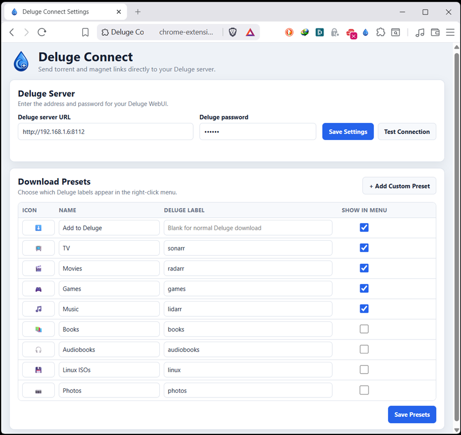
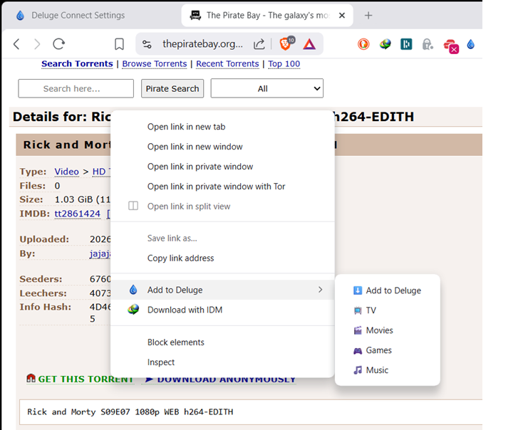
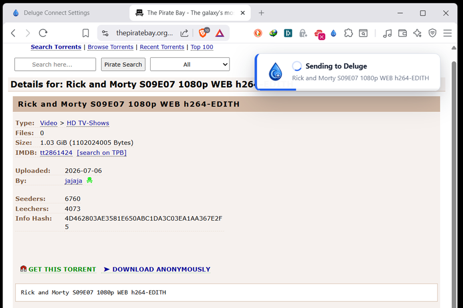

# Deluge Connect

> Send torrent and magnet links directly to your Deluge server from your browser.

Deluge Connect is a lightweight Chromium extension that lets you send torrents to your self-hosted Deluge instance without opening the Deluge Web UI.

Designed for fast, simple, self-hosted workflows.

---

## Features

* Right-click magnet links
* Right-click `.torrent` links
* Send torrents directly to Deluge
* Custom presets for TV, Movies, Games, and more
* Automatic label assignment when the Deluge Label plugin is installed
* Browser toast notifications
* Connection testing
* Password validation
* Modern options interface
* Compatible with Brave, Chrome, Edge, and other Chromium browsers

---

## Screenshots

### Options Page



### Context Menu



### Toast Notification



---

## Installation

### Download a release

Download the latest release ZIP from the GitHub Releases page.

Extract the ZIP into a permanent folder.

Open one of these pages in your browser:

```text
chrome://extensions
```

```text
brave://extensions
```

Enable **Developer mode**.

Click **Load unpacked** and select the extracted extension folder.

### Clone the repository

```bash
git clone https://github.com/ContentHuntr88/deluge-connect.git
```

Load the cloned folder as an unpacked extension.

---

## Configuration

Open the Deluge Connect options page.

Enter:

* Your Deluge WebUI address
* Your Deluge WebUI password

Example:

```text
http://localhost:8112
```

Click **Test Connection** to confirm Deluge Connect can communicate with your server.

---

## Presets

Presets let you send torrents using predefined labels.

Example:

| Preset | Deluge label |
| ------ | ------------ |
| TV     | sonarr       |
| Movies | radarr       |
| Games  | games        |

Select a preset from the Deluge Connect context menu when adding a torrent.

---

## Labels

When the Deluge Label plugin is enabled, Deluge Connect automatically applies the selected preset label.

When the plugin is unavailable, the torrent is still added successfully and Deluge Connect displays a notification explaining that the label was not applied.

---

## Permissions

Deluge Connect uses the following browser permissions:

* Storage
* Context menus
* Scripting
* Host access

Host access is required so the extension can communicate directly with the configured Deluge WebUI server.

Deluge Connect contains:

* No analytics
* No advertising
* No tracking
* No external cloud service

Communication occurs directly between your browser and your Deluge server.

---

## Development

No build tools are required.

Clone the repository and load the project directory as an unpacked Chromium extension.

---

## Reporting Issues

Bug reports and feature requests are welcome through GitHub Issues.

---

## License

Deluge Connect is released under the MIT License.

See the `LICENSE` file for details.
